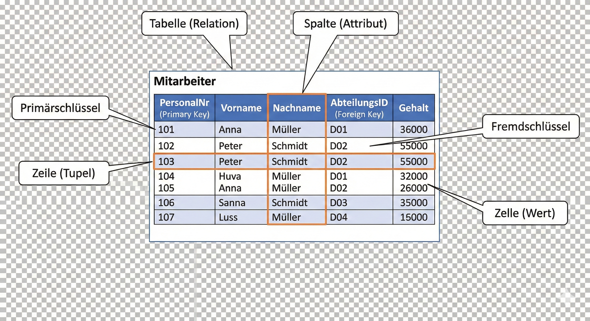
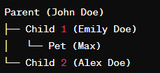

# Einführung in die Welt der Datenbanken

Stell dir vor, du baust das nächste Instagram oder Netflix. Wo speicherst du all die Benutzerprofile, Passwörter, Bilder und Likes? Wenn du sie einfach in einer Textdatei oder Excel-Tabelle speicherst, wird das System extrem langsam und fehleranfällig, sobald Millionen von Nutzern gleichzeitig darauf zugreifen.

Genau hier kommen Datenbanksysteme ins Spiel. Sie speichern Daten sicher, strukturiert und erlauben es, rasend schnell nach Informationen zu suchen.

### Welche Arten von Datenbanken gibt es?
Im Laufe der Zeit haben sich verschiedene Modelle entwickelt, je nachdem, welche Art von Daten gespeichert werden soll. Die modernen Systeme lassen sich grob in 3 große Arten zusammenfassen:

#### 1. Relationale Datenbanken
Das ist das bekannteste und am weitesten verbreitete Modell. Die Daten werden hier, ähnlich wie in Excel, in Tabellen (sogenannten Relationen) mit Zeilen und Spalten gespeichert und über Schlüssel miteinander verknüpft. Sie sind perfekt für klar strukturierte Daten (z. B. Kunden, Bestellungen). Um diese Tabellen im Vorfeld zu planen, nutzt man häufig sogenannte Chen-ER-Diagramme.
*Beispiele: MySQL, PostgreSQL, Oracle.*

#### 2. NoSQL Datenbanken
NoSQL (Not only SQL) verzichtet auf starre Tabellen und ist stattdessen auf Flexibilität und riesige Datenmengen ausgelegt. Man unterteilt sie in vier Kategorien:

1. **Dokumentenorientierte Datenbanken:** Hier werden Daten als flexible Text-Dokumente (oft im JSON-Format) gespeichert. Das ist super für Daten, die nicht immer gleich aufgebaut sind. 
   *Beispiel: MongoDB.*
2. **Graphen-Datenbanken:** Diese speichern Daten als Netzwerkknoten und deren Verbindungen. Sie sind ideal für soziale Netzwerke, um Fragen zu beantworten wie: "Wer folgt wem?". 
   *Beispiel: Neo4j.*
3. **Spaltenorientierte Datenbanken:** Sie speichern Daten nicht zeilen-, sondern spaltenweise. Das macht sie extrem schnell, wenn man riesige Datenmengen für Statistiken auswerten will. 
   *Beispiele: Cassandra, Scylla, HBase.*
4. **Key-Value Datenbanken:** Dieser DB-Typ speichert einfache Schlüssel-Wert-Paare. Das ist die unkomplizierteste und schnellste Möglichkeit, um Daten im Arbeitsspeicher abzulegen und abzurufen (z. B. für Warenkörbe oder Caching). 
   *Beispiele: Redis, Valkey, Amazon DynamoDB.*

#### 3. NewSQL Datenbanken
NewSQL-Systeme sind der Versuch, das Beste aus beiden Welten zu kombinieren: Sie bieten die hohe Zuverlässigkeit und Datenkonsistenz (ACID-Prinzipien) der klassischen relationalen Datenbanken und kombinieren diese mit der massiven, cloud-basierten Skalierbarkeit von NoSQL-Systemen.
*Beispiele: CockroachDB, Google Spanner.*

---

### Historische und spezialisierte Modelle
Neben den drei großen Kategorien gibt es noch weitere Ansätze, die entweder für ganz spezielle Zwecke genutzt werden oder historisch wichtig waren:

* **Hierarchische Datenbanken:**
  Wie der Name schon sagt, ähnelt dieses in den 1960er Jahren entwickelte Modell einem Stammbaum (Eltern-Kind-Beziehung). Jeder übergeordnete Datensatz kann mehrere untergeordnete haben, aber ein Kind gehört immer zu genau einem Elternteil.
  *Beispiele: Windows-Registrierung, XML, Sitemaps.*
  
  

* **Netzwerkdatenbanken:**
  Ähnelt der hierarchischen Datenbank, erlaubt aber, dass ein untergeordneter Datensatz mit mehreren übergeordneten Datensätzen verbunden ist (bidirektionale Beziehungen).

* **Objektorientierte Datenbanken:**
  Hier speichert das System Informationen basierend auf den Prinzipien der objektorientierten Programmierung. Die Objekte enthalten Attribute (Daten) und Methoden (Funktionen), wodurch sie von der Software oft direkter ausgelesen werden können.
  *Beispiele: ObjectDB, Db4o.*
