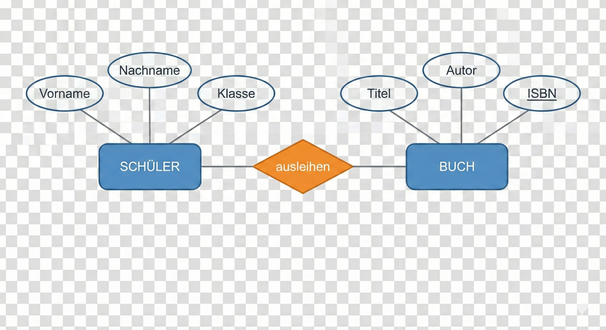
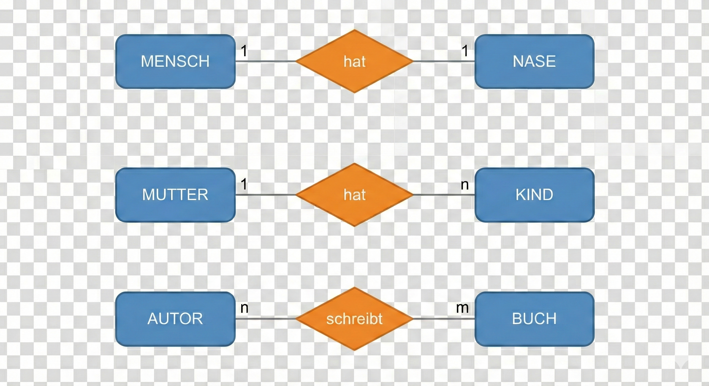

### Wie entwirft man eine Datenbank? (Datenbank-Design)
Bevor man anfängt, am Computer Tabellen zu erstellen, muss man die Datenbank planen. Dieser Prozess nennt sich Datenbankentwurf und verläuft in mehreren Schritten.

#### 1. Die Anforderungsanalyse (Was brauchen wir?)
Zuerst muss man herausfinden: Welche Daten müssen überhaupt gespeichert werden? Und was soll später damit gemacht werden? 
*Beispiel: Für eine Schulbibliothek brauchen wir Bücher und Schüler.*

#### 2. Der Konzeptionelle Entwurf (Das ER-Modell)
Jetzt wird ein Bauplan gezeichnet. Dafür nutzt man das sogenannte Entity-Relationship-Modell (ER-Modell oder ERM). Es ist das bekannteste Modell, um die reale Welt stark vereinfacht grafisch darzustellen.

Es besteht aus drei Hauptbausteinen:
1. **Entitäten (Entities):** Das sind die "Dinge" oder "Objekte", über die wir Daten speichern wollen (z. B. Schüler, Bücher). Sie werden als Rechtecke gezeichnet.
2. **Attribute:** Das sind die Eigenschaften dieser Dinge (z. B. Vorname, Nachname beim Schüler; Titel beim Buch). Sie werden als Ellipsen (Ovale) an die Rechtecke gehängt.
3. **Beziehungen (Relationships):** Sie zeigen, wie die Dinge miteinander zusammenhängen (z. B. "Schüler leiht Buch"). Sie werden als Rauten dargestellt.

*Ein einfaches ER-Diagramm (Chen-Notation)*

**2.1 Die Schlüsselverteilung (Identifikation)**
Damit man nicht zwei Schüler mit dem Namen "Thomas Müller" verwechselt, braucht jedes Objekt ein eindeutiges Erkennungsmerkmal.

* **Primärschlüssel (Primary Key):** Das ist ein Attribut, das jeden Datensatz absolut einzigartig macht. In der Schule ist das die Schülernummer, beim Buch die ISBN-Nummer. In der Grafik werden Primärschlüssel oft unterstrichen.
* **Fremdschlüssel (Foreign Key):** Wenn ein Schüler ein Buch ausleiht, wird in der Ausleih-Tabelle die Schülernummer gespeichert. Diese Nummer "verweist" dann als Fremdschlüssel auf den echten Schüler.

**2.2 Die Kardinalitäten (Wer mit wem und wie oft?)**
Wir müssen festlegen, wie viele Objekte miteinander in Beziehung stehen können. Das nennt man Kardinalität. Es gibt drei wichtige Arten:

* **1:1-Beziehung:** Jedem Objekt aus Menge A ist genau ein Objekt aus Menge B zugeordnet.
  *Beispiel: Jeder Schüler besitzt genau einen Bibliotheksausweis, und jeder Ausweis gehört zu genau einem Schüler.*
* **1:n-Beziehung (Eins-zu-vielen):** Ein Objekt aus Menge A steht mit vielen Objekten aus Menge B in Beziehung, aber jedes Objekt aus B gehört nur zu einem Objekt aus A.
  *Beispiel: Ein Verlag bringt viele Bücher heraus, aber ein bestimmtes Buch gehört (meistens) zu genau einem Verlag.*
* **n:m-Beziehung (Viele-zu-vielen):** Mehrere Objekte können mit mehreren Objekten verbunden sein.
  *Beispiel: Ein Schüler kann mehrere Bücher ausleihen, und ein Buch kann im Laufe der Zeit von mehreren Schülern ausgeliehen werden.*

*Darstellung der Kardinalitäten*

#### 3. Der Logische Entwurf und Normalisierung (Aufräumen)
Wenn der grafische Bauplan fertig ist, übersetzt man ihn in echte Tabellen (Logischer Entwurf). 
*Wichtig: Da relationale Datenbanken keine n:m-Beziehungen direkt speichern können, werden diese in diesem Schritt aufgelöst, indem man eine zusätzliche Verknüpfungstabelle (z. B. "Ausleihe") dazwischenschaltet.*

Dabei wendet man auch einen sogenannten Normalisierungsprozess an. Das Ziel der Normalisierung ist es, die Datenbank sauber und fehlerfrei zu machen:

1. **Redundanzen vermeiden:** Das bedeutet, dass man Daten nicht unnötig doppelt speichern will (z. B. sollte der Name eines Autors nicht in jeder Buchzeile neu hingeschrieben werden, sondern nur einmal in einer separaten Autoren-Tabelle stehen).
2. **Anomalien beheben:** Wenn man den Namen eines Autors ändert, soll das nicht in 100 Zeilen manuell geändert werden müssen (Änderungs-Anomalie), sondern nur an genau einer Stelle.

#### 4. physische Phase
In dieser Phase wird der Logische Entwurf in der Datenbank mit der Sprache **SQL (Structured Query Language)** umgesetzt!
